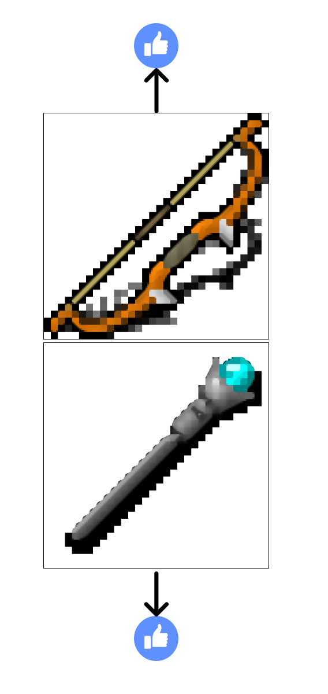
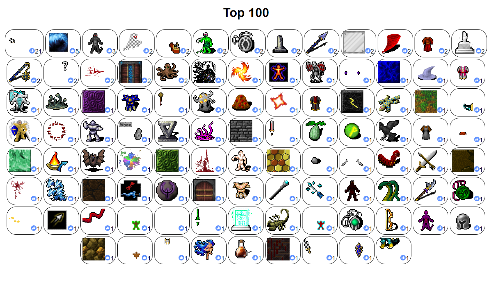

# Rogue Likes

Should be [live](https://emh.lart.no/publish/roguelikes/).

Rogue Likes is a small game designed to rank roguelike pixel art, specifically
Dungeon Crawl Stone Soup art in this case. It should work on recent mobiles.

The rules are simple:
Swipe up to like the top image, swipe down to like the bottom image.
Or tap the arrows on screen or use keyboard arrows up and down.
The other image is downvoted.

Every 10th swipe you will get to see the current top 20 (screenshot has 100)
liked pixel arts, calculated as the difference between upvotes and downvotes.

That's it. Enjoy!

PS: If you want the summarized likes data in JSON try this URL:
https://emh.lart.no/stockpilerpg/status?top=1000

Indexed file list relative to [live](https://emh.lart.no/publish/roguelikes/)
is at https://emh.lart.no/publish/roguelikes/src/filelist.js .
Image ids in the JSON is index in this file list.
